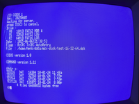

# cxdos
msx compact extended dos

**UNDER CONSTRUCTION**

## Introduction

This repository contains alternatives for the MSX DOS 1 and 2 disk ROM's.

## CXDOS 1

RAM loadable DOS, the kernel functions are compatible with MSX DOS 1.  
This DOS version can be loaded from MSX-DOS (diskette) or from BASIC (tape) and includes a driver for either the JIO, SODA or BEER IDE interface.  

  
**Enhancements**  
Large disk support (FAT12 / FAT16) with up to 8 partitions and faster execution of DOS functions.
  
**Limitations**
- BASIC ROM not used / BASIC not available
- No FORMAT command
- No msxdos.sys, the sys code is part of the kernel at a fixed address
- Any other disk interfaces will be de-activated on start
- The free TPA memory is 48KB

**Use cases**
- Learning and experimentation
- Test / entry level disk system for MSX with JIO server 
- DIY small Z80 (CP/M) retrocomputers without MSX BASIC ROM
- Reflash disk ROM from MSX

## CXDOS 2

**Under construction**  
DOS for MSX1 and newer machines with limited ROM or RAM resources, the kernel functions are compatible with MSX-DOS 2.
A demo version is built that will run on a MSX1 with 32K disk ROM and 64K system RAM.

## License
The license terms apply to all material, with the exception of code that is based on existing work by others that is shared publicly and re-used widely without mentioning specific license terms or restrictions. The origins of these parts are mentioned in the source code and it's copyright is respected when applicable.

